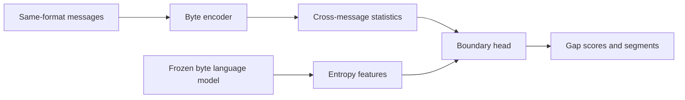

<div align="center">

# NeurInferno

**Field-boundary inference for unlabeled binary protocol messages**

[](https://github.com/Sachithx/NeurInferno/actions/workflows/ci.yml)
[](https://pypi.org/project/neurinferno/)
[](https://pypi.org/project/neurinferno/)
[](LICENSE)
[](https://huggingface.co/spaces/sachithabey/neurinferno)

[Live demo](https://huggingface.co/spaces/sachithabey/neurinferno)
· [Model](https://huggingface.co/sachithabey/neurinferno)
· [Dataset](https://huggingface.co/datasets/sachithabey/neurinferno)
· [Report a bug](https://github.com/Sachithx/NeurInferno/issues/new/choose)

</div>

NeurInferno analyzes a batch of binary messages that share a format and
predicts the byte gaps most likely to be field boundaries. It works without
field labels at inference time and returns boundaries, confidence scores, and
the corresponding byte segments.

> [!IMPORTANT]
> NeurInferno predicts structural boundaries, not field names or protocol
> semantics. Review predictions before using them in downstream tooling.

## Install

```bash
python -m pip install neurinferno
```

Python 3.10 or newer is required. Inference works on CPU; training requires a
CUDA-capable environment.

## Quick start

```python
from neurinferno import FieldBoundaryModel

messages = [
    "0001080006040001900c2d9bfa4649e7160700000000000043f03612",
    "0001080006040002fbccad5c9fb1d014735252376fd2446375217d01",
    "0001080006040002a388be2d1d684df0f31908ae1acad25b4dca7aa8",
    "0001080006040001d41cd6668e87ac1e6d7b0000000000008593a2d9",
]

model = FieldBoundaryModel.from_pretrained()
for message_index, result in enumerate(model.infer(messages), start=1):
    print(f"message {message_index}")
    for segment in result.segments:
        print(f"  [{segment.start}:{segment.end}] {segment.hex}")
```

The first call to `from_pretrained()` downloads and caches the model artifact.
For reliable cross-message statistics, provide at least four messages from the
same format.

## Command line

Place one hexadecimal message on each line of a file:

```bash
neurinferno infer messages.hex
neurinferno infer messages.hex --threshold 0.85
neurinferno infer messages.hex --format json
```

Standard input is supported when the path is omitted:

```bash
printf '0001aaff\n0002bbff\n' | neurinferno infer
```

Use a local checkpoint with `--ckpt path/to/model.ckpt`, or select another
Hugging Face model repository with `--repo namespace/name`.

## Input and output

Inputs may use plain hex or common separators:

```text
0001080006040001
0x00 0x01 0x08 0x00 0x06 0x04 0x00 0x02
00:01:08:00:06:04:00:03
```

Unsupported characters, empty messages, invalid thresholds, and oversized
batches produce explicit errors. Messages longer than the model context are
marked as truncated in `MessageResult`.

Each result contains:

| Attribute | Meaning |
|---|---|
| `hex` | Hexadecimal bytes processed by the model. |
| `n_bytes` | Number of processed bytes. |
| `original_n_bytes` | Input length before context truncation. |
| `truncated` | Whether the input exceeded the model context. |
| `scores` | Boundary probability for every gap between adjacent bytes. |
| `cuts` | Boolean decisions after applying the threshold. |
| `segments` | Predicted fields with start offset, end offset, and hex. |

## How it works



A byte-level transformer processes the messages together. Cross-message mean,
maximum, and variance features capture how bytes behave at the same offset,
while a frozen byte language model supplies entropy features. The boundary head
assigns a probability to each gap between consecutive bytes.

## Data

The full dataset is hosted separately from the Python package:

```bash
hf download sachithabey/neurinferno \
  --repo-type dataset \
  --local-dir data
```

This creates `data/protocols/` with labeled protocol traces and `data/grammar/`
with synthetic formats.

Each `messages.jsonl` line has this structure:

```json
{
  "bytes_hex": "0001080006040001...",
  "field_type_per_byte": [2, 2, 2, 2, 1, 1],
  "boundary_per_gap": [0, 1, 0, 1, 1],
  "format_id": "example_00000",
  "endianness": "big"
}
```

| Field | Required | Meaning |
|---|---|---|
| `bytes_hex` | Yes | Lowercase hexadecimal bytes with an even length. |
| `boundary_per_gap` | Yes | Length `n_bytes - 1`; `1` marks a boundary after that byte. |
| `field_type_per_byte` | Yes | Length `n_bytes`; auxiliary training type identifiers. |
| `format_id` | Yes | Format identifier; identifiers ending in `_corrupted` are excluded from evaluation. |
| `endianness` | No | `big` or `little`. |

Field type identifiers are defined in
[`label_format.py`](src/neurinferno/data_generation/label_format.py).

## Training and evaluation

Clone the repository and install the training dependencies:

```bash
git clone https://github.com/Sachithx/NeurInferno.git
cd NeurInferno
python -m venv .venv
source .venv/bin/activate
python -m pip install -e ".[train]"
hf download sachithabey/neurinferno --repo-type dataset --local-dir data
```

Run training or evaluate existing checkpoints:

```bash
CUDA_VISIBLE_DEVICES=0 bash train.sh
bash download_checkpoints.sh
CUDA_VISIBLE_DEVICES=0 bash eval.sh
```

The training scripts skip folds that already have checkpoints. The configured
LOPO and L4PO splits exclude held-out protocols from language-model training,
main-model training, and fine-tuning.

### Adding a protocol

1. Create `data/protocols/<name>/messages.jsonl`.
2. Add the name to `LOPO_PROTOCOLS` in
   [`dataset.py`](src/neurinferno/training/dataset.py) and `train.sh`.
3. Add it to the required L4PO split definitions in `train.sh`.
4. Train the affected folds and run the evaluation suite.

Directory names must be unique and contain only lowercase letters, numbers,
and underscores.

## Repository layout

```text
src/neurinferno/   Installable package and model implementation
tests/             Unit and interface-helper tests
examples/          Small runnable examples
hf_space/          Hugging Face Space interface and deployment helper
data/              Training and evaluation data layout
train.sh           Reproducible training entry point
eval.sh            Evaluation entry point
```

## Development

```bash
python -m pip install -e ".[dev,demo]"
ruff check .
ruff format --check .
pytest
python -m build
twine check dist/*
```

See [CONTRIBUTING.md](CONTRIBUTING.md) for contribution expectations and
[SECURITY.md](SECURITY.md) for private vulnerability reporting.

## Project status

NeurInferno is an alpha-stage research software project. Interfaces may evolve
between minor releases. Pin a version when integrating it into another system.

## License

Licensed under Apache-2.0. See [LICENSE](LICENSE).
